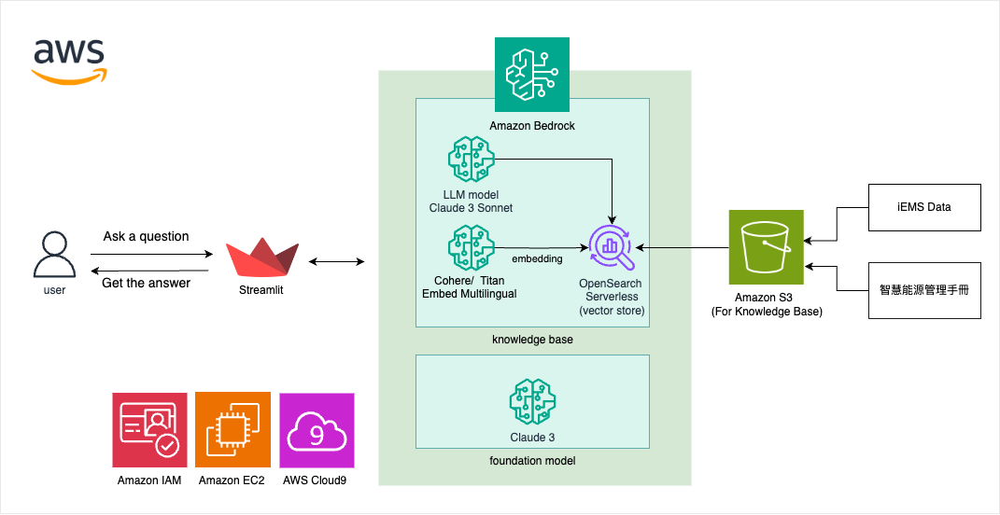

# Overview
## This is a project for 雲湧智生：臺灣生成式 AI 應用黑客松競賽
## 主題
* 運用 Generative AI 技術實現智慧節能的使用者體驗革命
* 目標對象（TA）
  * 此應用目的在於協助初次接觸節能領域的用戶，讓他們能夠：
    * 針對問題分析：總結能源使用狀況，並對異常區域或設備進行深入分析。
    * 專家意見：發現能耗異常時，提供必要的背景資訊來輔助決策。
    * 數據評估：根據管理者的關注點，提取監測數據並轉化為評估結果，幫助他們快速了解效能問題點。
* 介面: 提供文字建議與可視覺化圖表

## Agent
* 數據分析Agent 
  * 節能建議提供
    * 提供每日用電情況是否異常的建議
    * 分析特定日期範圍內的用電量和需量
    * 建議如何排除用電異常問題
    * 需量管理策略
    * 提供不同區域需量的監測和管理策略
   * 分析和建議如何避免用電超出目標需量
# Overview
## This is a project for 雲湧智生：臺灣生成式 AI 應用黑客松競賽
## 主題
* 運用 Generative AI 技術實現智慧節能的使用者體驗革命
* 目標對象（TA）:
此應用目的在於協助初次接觸節能領域的用戶，讓他們能夠：
* 針對問題分析：總結能源使用狀況，並對異常區域或設備進行深入分析。
* 專家意見：發現能耗異常時，提供必要的背景資訊來輔助決策。
* 數據評估：根據管理者的關注點，提取監測數據並轉化為評估結果，幫助他們快速了解效能問題點。
## 介面: 提供文字建議與可視覺化圖表

## Agent
### 數據分析Agent 
1. 節能建議提供
    * 提供每日用電情況是否異常的建議
    * 分析特定日期範圍內的用電量和需量
    * 建議如何排除用電異常問題
2. 需量管理策略
    * 提供不同區域需量的監測和管理策略
    * 分析和建議如何避免用電超出目標需量
3. 節點能耗數據分析
    * 分析不同設備的用電情況，提供節能建議
    * 根據能耗數據，進行趨勢分析並提供改善建議
4. 異常提醒
    * 針對管理者，即時給予異常警示訊息
### 系統操作與維修Agent
1. 常見問題提示
    * 提示常見設備故障問題及其解決方案
    * 提供設備維修流程的建議
2. 問題代碼說明
    * 解釋設備故障代碼，提供具體解決步驟
3. 建議維修流程
    * 根據設備異常情況，建議最佳的維修流程
4. 動態支援系統操作問題
    * 解釋專有名詞和圖表的意義
    * 提供系統使用手冊和操作指引
5. 數據分析
    * 提供總用能分析和能耗排名
    * 支持多物件對比和多時間對比分析
## 功能串接
1. AWS Bedrock 生成式AI
    * 利用AWS Bedrock 提供自然語言處理和生成式AI技術，實現問答和建議生成
    * 與研華的iEMS系統數據使用Knowledge Base串接，實現數據驅動的節能建議和分析
2. API 整合
    * 使用WISE-iEMS系統的API接口，實現數據的實時獲取和更新
    * 通過API與Lambda互動，實現數據分析與前後端互動
3. 數據存儲與處理
    * 使用AWS的S3 bucket, DynamoDB 進行存儲，確保數據的安全性和可擴展性
    * 利用生成式AI進行數據處理和分析，提供高效的節能建議

## 流程圖：

## 如何應用串接企業數據及資料應用
* 使用研華提供之API抓取能源資料來做為模型的搜索資料，並利用chatbot將資料呈現給使用者，還有將智慧能源管理繁中手冊作為系統操作與維修聊天機器人之參考依據。最後我們利用生成式AI來分析能源資料，並在出現異常時做出提醒。

##
# Start App:
 >   streamlit run main.py --server.port 8080